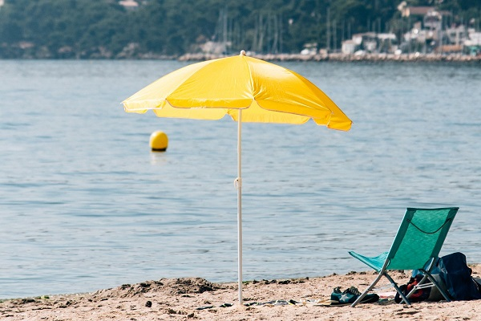

# AI-Powered Image Inpainting  

## 📌 Project Overview  
This project focuses on **image inpainting**, a technique used to remove objects from images and reconstruct missing areas in a realistic way. Our algorithm automatically detects and fills missing parts of an image by analyzing surrounding pixels, ensuring a smooth and coherent restoration.  

## 🎯 Objectives  
- Develop an **automated image inpainting algorithm**.  
- Implement **contour detection** and **confidence scoring** for accurate restoration.  
- Optimize the algorithm for improved efficiency and speed.  
- Create a **user-friendly interface** for intuitive use.  

## 🛠️ Technologies Used  
- **Python**  
- **OpenCV** (image processing)  
- **NumPy** (matrix operations)  
- **Tkinter** (GUI interface)  

## 🚀 Features  
✔️ **Mask Creation** – Users can select objects to remove from an image.  
✔️ **Contour Detection** – Automatically identifies edges for seamless reconstruction.  
✔️ **Pixel Matching Algorithm** – Finds the best replacement pixels from the surrounding area.  
✔️ **Optimization Techniques** – Reduces computation time while maintaining quality.  
✔️ **User Interface** – Simple GUI for image selection and mask application.  

## 🔍 How It Works  
1. **User selects an image** and applies a mask over the object to be removed.  
2. **Contour detection** identifies the region's edges.  
3. The algorithm **searches for the best-matching pixels** to reconstruct the missing area.  
4. The process **iterates** until the entire masked region is filled.  

## 📷 Examples  
### Input Image (with mask)  
  

### Processed Image  
  

## 🏆 Results & Challenges

### ✅ Achievements  
- **Effective Image Reconstruction** – The algorithm successfully restores missing image parts using **contour detection & pixel matching**.  
- **User-Friendly Interface** – Developed an intuitive **Tkinter GUI** for seamless interaction.  
- **Optimized Processing** – Reduced execution time while maintaining reconstruction quality.  

### ⚠️ Challenges  
- **Processing Time** – The algorithm struggles with **large image sizes**, significantly increasing computation time.  
- **Complex Backgrounds** – Reconstruction quality decreases when the missing area overlaps with **highly detailed backgrounds**.

### 📜 Future Improvements
- Implement Deep Learning-based inpainting (GANs, CNNs).
- Optimize algorithm speed for real-time processing.
- Improve edge detection techniques for better blending.  

